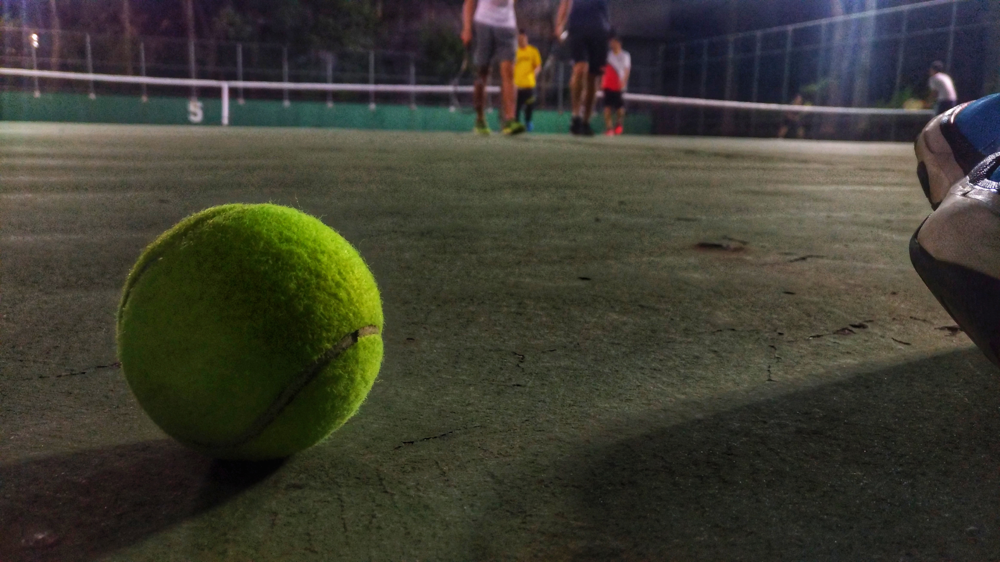
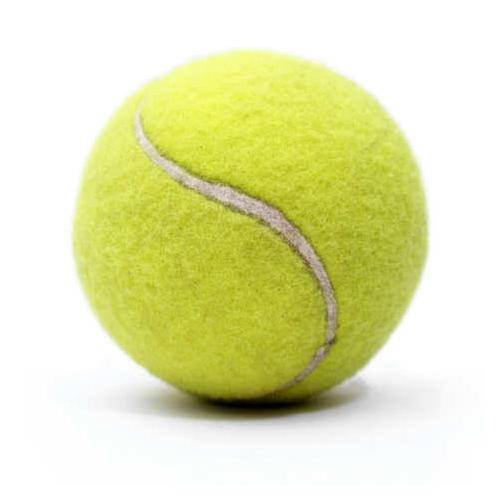
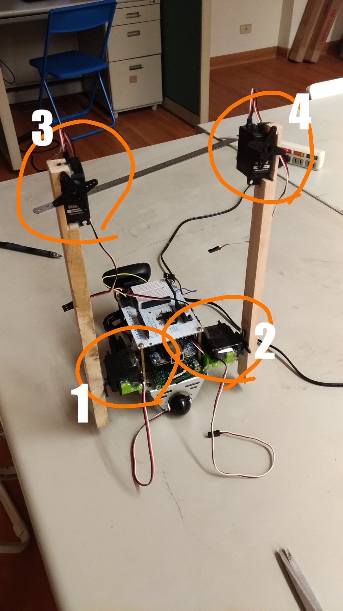

# EE2405 mbed Midterm Project

## Introduction
In this project, we build a Tennisball Picker Robot based on a BOE-BOT car built from Lab12. <br/>
For more detail information are written in proposal pptx. FYI.
[Proposal.pptx](https://drive.google.com/file/d/1UyXgMctM9HecNW7fyRGYvZobNH92HC7Q/view?usp=sharing)


## Requirements
1. Build **a BOE-BOT car**. Please refer to: [mbed Lab12](http://www1.ee.nthu.edu.tw/ee240500/mbed-lab-12-boe-bot-car.html)
2. Prepare a Raspberry Pi 3 Model B borad. [Official site]
(https://www.raspberrypi.org/products/raspberry-pi-3-model-b/) 

3. A tennis ball 

4. A Web Camera

## Get Started

### BOE-BOT Car (K64F)
1. Please login in gitlab, clone and prepare a working directory.
    1. `$ git clone git@gitlab.larc-nthu.net:104061203/midterm_project.git`
    2. `$ cd midterm_project/`
2. Build the car like this:<br/>

    * 1: Standard Servo. `{5V: 5V , SIG: D5, GND: GND}`
    * 2: Standard Servo. `{5V: 5V , SIG: D6, GND: GND}`
    * 3: Standard Servo. `{5V: 5V , SIG: D9, GND: GND}`
    * 4: Standard Servo. `{5V: 5V , SIG: D10, GND: GND}`

2. Add Parallax Library to the project directory
    * `$ mbed add http://gitlab.larc-nthu.net/embedded_lab/parallax`
2. Start VS Code to edit `main.cpp`
    * `$ code main.cpp &`
3. Copy the following codes into `main.cpp`. We use the following codes to build the **Controller Of the Car**
    ```cpp
    #include "mbed-os/mbed.h"
    #include "parallax/parallax.h"

    double SERVO_CONTROL_DELAY = 0.1f;
    Serial pc(USBTX, USBRX);
    Serial rpi(D1, D0);
    PwmOut left_servo_pin(D11), right_servo_pin(D12);
    PwmOut left_shoulder_pin(D5), right_shoulder_pin(D6);
    PwmOut left_wrist_pin(D9), right_wrist_pin(D10);

    parallax_servo *left_servo, *right_servo;
    parallax_stdservo *left_shoulder, *right_shoulder, *left_wrist, *right_wrist;
    void car_set_speed(int, int);
    void arm_set_init();
    void catch_the_ball();

    void init(){
        left_servo = new parallax_servo(left_servo_pin);
        right_servo = new parallax_servo(right_servo_pin);
        servo_ticker.attach(&servo_control, .5);

        wait(5);
        car_set_speed(0, 0);
        arm_set_init();

        pc.baud(115200);
        rpi.baud(38400);
    }

    void flushSerialBuffer(void) { 
        char char1 = 0; 
        while (pc.readable()){ 
            char1 = pc.getc(); 
        } 
        return; 
    }

    int main(void){
        init();

        while(1){
            while(rpi.readable()){
                char c = rpi.getc();
                flushSerialBuffer();
                pc.printf("%d\n\r", c);
                if (c == 'w'){
                    car_set_speed(50, 50);
                }
                else if (c == 'b'){
                    car_set_speed(-20, -20);
                }
                else if (c == 'l'){
                    car_set_speed(-20, 20);
                }
                else if (c == 'r'){
                    car_set_speed(20, -20);
                }
                else if (c == 'c'){
                    car_set_speed(0, 0);
                    catch_the_ball();
                }
                else {
                    car_set_speed(0, 0);
                }
            }
        }
    }

    void catch_the_ball(){
        int i;

        for (i = (-90); i <= 20; i+=5){
            *left_shoulder = i;
            wait(0.05f);
            *right_shoulder = 0 - i;
            wait(0.05f);
            // printf("%d\n\r", i);
        }
        wait(1);

        *left_wrist = 20;
        wait(0.5);
        *right_wrist = -20;
        wait(1.5);
        for (i = (-90); i <= 20; i+=){
            *left_wrist = i;
            *right_wrist = 0 - i;
            wait(0.02f);
        }

        *left_shoulder = -90;
        *right_shoulder = 90;
        wait(1);
        for (i = 90; i--; i > -90){
            *left_wrist = i;
            *right_wrist = 0 - i;
            wait(0.01f);
        }
        *left_wrist = 90;
        *right_wrist = -90;
        wait(5);
    }

    void arm_set_init(){
        *left_shoulder = (-90);
        *right_shoulder = (90);

        *left_wrist = 90;
        *right_wrist = -90;
    }

    void car_set_speed(int left, int right){
        *left_servo = left;
        *right_servo = 0 - right;
        wait(SERVO_CONTROL_DELAY);
    }
    ```
4. Compile the program.
    * Use Micro USB transfer line to connect K64F to computer.
    * `$ ls /dev/ttyACM*` You should see a result: `/dev/ttyACM0` (on Ubuntu)
    * `$ sudo mbed compile -m K64F -t GCC_ARM -f`
    * After compiling, please press reset button to initialize the K64F.

### Host (Raspberry Pi)
1. Setup a Raspberry Pi 3 board.
    1. Install an OS(Raspbian) on board. FYI:[Install an Operating System On Linux](https://www.raspberrypi.org/documentation/installation/installing-images/linux.md)
    2. Login to Raspbian OS, and set WIFI to connect the same host. (same local network)
    3. Install necessary packages:
        1. `$ sudo apt-get update`
        2. `$ sudo apt-get install -y git python3-dev`
        3. `$ sudo apt-get install -y python3-pip`
2. Please login in gitlab, clone and prepare a working directory.
    1. `$ mkdir -p ~/midterm && cd ~/midterm`
    1. `$ git clone git@gitlab.larc-nthu.net:104061203/midterm_project_raspberry.git`
    2. `$ cd midterm_project_raspberry/`
3. Install necessary Python packages:
    * `$ pip3 install numpy pyserial opencv-python`
4. Start VS Code to edit `main.py`
    * `$ code main.py`
5. Copy the following codes into `main.py`. The following codes is to built the **Ball-Detection Program** and **K64F Controller**.
    ```python
    import cv2
    import numpy as np
    import math
    import time
    import serial

    k64f = serial.Serial('/dev/ttyAMA0')
    k64f.baudrate = 38400

    cap = cv2.VideoCapture(0)

    STATE = ('IDLE', 'SCAN', 'FOUND', 'READY', 'CATCH')
    ACTION = {
        'Forward': "w",
        'Backward': "b",
        'Left': "l",
        'Right': "r",
        'Stop': "s",
        'Catch': "c"
    }
    RADIUS_THRESHHOLD = 30
    SCAN_DELTA_LIMIT = 100
    SCAN_OK_FRAMES_LIMIT = 5
    FOUND_CENTER_X = 280
    FOUND_ERROR_X = 80

    TENNIS_UPPER = (50, 210, 255)
    TENNIS_LOWER = (25, 40, 50)

    currentFrame = 0
    currentState = STATE[1]
    lastCenter = (0, 0)

    def move(command=ACTION['Stop']):
        k64f.write(command.encode())
        print(len(command.encode()))
        time.sleep(0.15)
        k64f.write(ACTION['Stop'].encode())

    while(True):
        ret, frame = cap.read()
        img = frame
        hsv = cv2.cvtColor(frame, cv2.COLOR_BGR2HSV)
        mask = cv2.inRange(hsv, TENNIS_LOWER, TENNIS_UPPER)
        mask = cv2.erode(mask, kernel=np.ones((5, 5), np.uint8), iterations=1)
        mask = cv2.dilate(mask, None, iterations=3)
        contours = cv2.findContours(mask.copy(), cv2.RETR_EXTERNAL, cv2.CHAIN_APPROX_SIMPLE)[-2]
        if len(contours) > 0:
            c = max(contours, key=cv2.contourArea)
            ((x, y), radius) = cv2.minEnclosingCircle(c)        
            if radius > RADIUS_THRESHHOLD:              ## circle avaliable in view
                M = cv2.moments(c)
                try:
                    center = (int(M["m10"] / M["m00"]), int(M["m01"] / M["m00"]))
                except Exception:
                    pass
                
                if currentState is 'SCAN':
                    print('Current Status: SCANING...')
                    move(ACTION['Forward'])
                    distance = math.sqrt((center[0]-lastCenter[0])**2 + (center[1]-lastCenter[1])**2)
                    print("distance: ", distance)
                    if distance > SCAN_DELTA_LIMIT:
                        lastCenter = center
                        scanOkFrames = 0
                    else:
                        scanOkFrames += 1
                        if scanOkFrames >= SCAN_OK_FRAMES_LIMIT:
                            currentState = 'FOUND'
                            scanOkFrames = 0
                
                elif currentState is 'FOUND':
                    print('Current Status: Found a ball! Attempt to approach it...')
                    center_x, center_y = center[0], center[1] 
                    
                    if center_x < FOUND_CENTER_X - FOUND_ERROR_X:
                        move(ACTION['Left'])
                        print("move left")
                    elif center_x > FOUND_CENTER_X + FOUND_ERROR_X:
                        move(ACTION['Right'])
                        print("move right")
                    elif radius > 190:
                        move(ACTION['Backward'])
                        print("back")
                    elif radius < 160:
                        move(ACTION['Forward'])
                        print("forward")
                    else:
                        move(ACTION['Stop'])
                        currentState = 'READY'

                elif currentState is 'READY':
                    print('Current Status: Ready to catch the ball!')
                    move(ACTION['Stop'])
                    move(ACTION['Catch'])
                    print('Current Status: Catch!')
                    time.sleep(5)
                    currentState = 'SCAN'

                print(radius)                           ## for debug
            elif currentState == 'FOUND':
                move(ACTION['Backward'])
            
        if cv2.waitKey(1) & 0xFF == ord('q'):
            break
    cap.release()
    cv2.destroyAllWindows()
    ```
6. Plug the Web Camera on Raspberry Pi board
6. Run `main.py` to start the script.
    * `$ sudo python3 main.py`